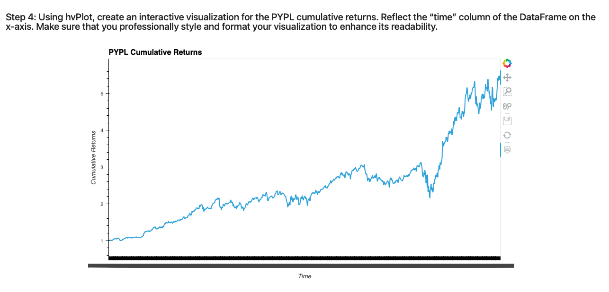
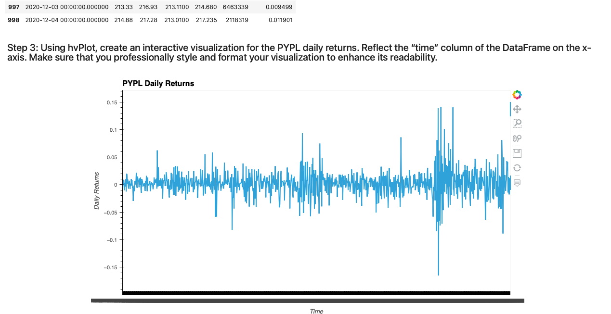
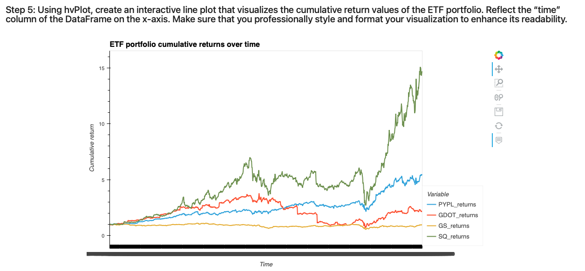
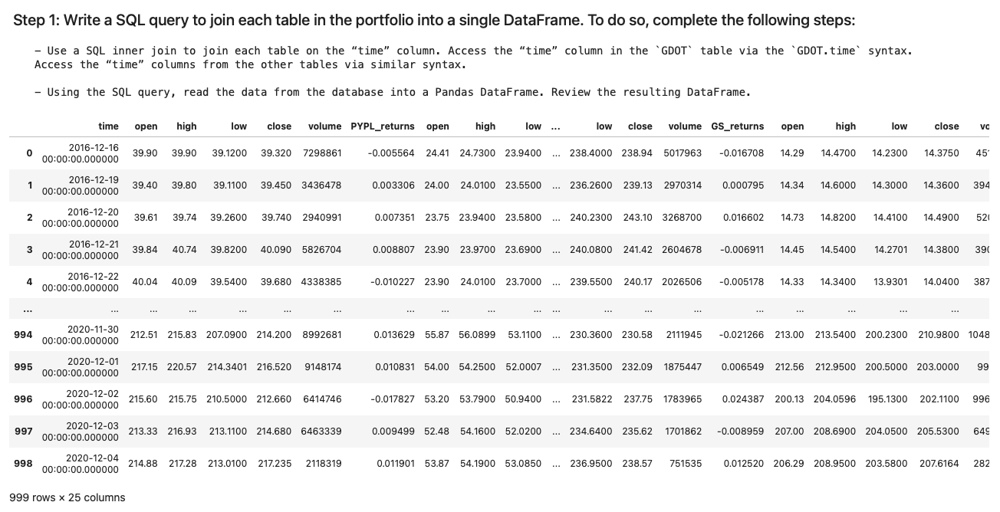

# fintech_mod7

# Analyzing the performance of the ETF portfolio using SQL, Pyton, and Voila

For this assignment, the following objectives were met:

A Jupyter notebook that contains the following:

* Your analysis of the ETF data that a SQL database stores

* A screenshot or video of the web application that you created by deploying your Jupyter notebook via the Voilà library

## Technologies

The following modules were imported to use for the exercise:

import numpy as np

import pandas as pd

import hvplot.pandas

import sqlalchemy

from sqlalchemy import inspect

The following database is supplied: etf.db. This database is connected to via the following way:

database_connection_string = 'sqlite:///etf.db'

## Usage

Voila was used to deploy the Notebook as a web application. The screenshots below show sections of the web app. 

